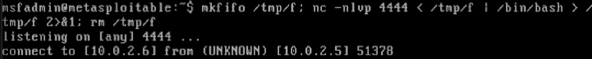
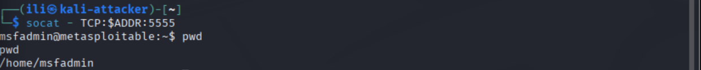
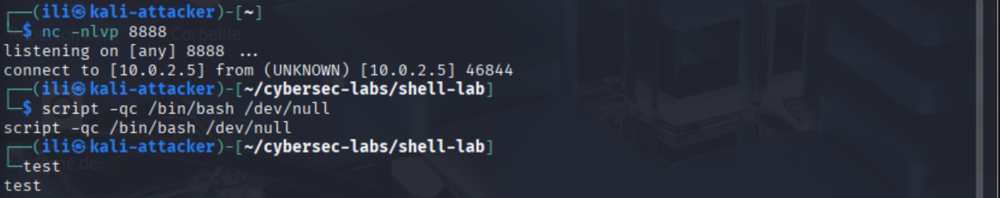

# Binding and Reverse Shells Lab

## Overview
This lab explores the creation, stabilization, and detection of **bind shells** and **reverse shells**, essential techniques for penetration testing and red teaming. The project demonstrates how to establish persistent access to target systems, stabilize shells for better usability, and detect unauthorized shell activity.

---

## Objectives
- Establish **bind shells** and **reverse shells** using `netcat` and `socat`.
- Stabilize shells for interactive use and advanced functionality.
- Detect and analyze suspicious shell activity on target systems.

---

## Methodology

### 1. Basic Bind Shells
Launched a **bind listener** on the target machine and connected from the attacker machine to execute commands and identify the system.

- **Netcat Bind Shell:**
  
  

- **Socat Bind Shell:**
  Improved stability and functionality compared to plain `netcat`.
  

---

### 2. Basic Reverse Shells
Started a listener on the attacker machine and triggered a reverse connection using **Bash TCP redirection**.

- **Attacker Console:**
  

---

### 3. Advanced Shell Techniques
After obtaining shells, stabilized them into **interactive shells** to enable features like autocompletion.

- **Shell Stabilization:**
  

- **Windows Shell via PowerShell:**
  Connected to a Windows machine using a small PowerShell script.
  - **Attacker Console:**
    
  - **Target Console:**
    

---

### 4. Shell Detection and Prevention
Monitored listening ports and new connections using a script to detect unauthorized activity.

- **Port Analysis Script Results:**
  

- **Example Detection:**
  Identified the binding shell process on the attacker machine.

---

## Key Findings
- **Bind Shells:** Successfully established and connected to bind shells using `netcat` and `socat`.
- **Reverse Shells:** Demonstrated reverse shell techniques using Bash TCP redirection.
- **Shell Stabilization:** Improved shell usability with interactive features.
- **Detection:** Developed methods to detect and analyze suspicious shell activity.

---

## Skills Demonstrated
- **Shell Creation:** Proficient in creating bind and reverse shells.
- **Shell Stabilization:** Ability to enhance shells for interactive use.
- **Detection and Analysis:** Capable of monitoring and detecting unauthorized shell activity.

---

## Tools Used
- **Netcat (`nc`)**
- **Socat**
- **Bash**
- **PowerShell**
