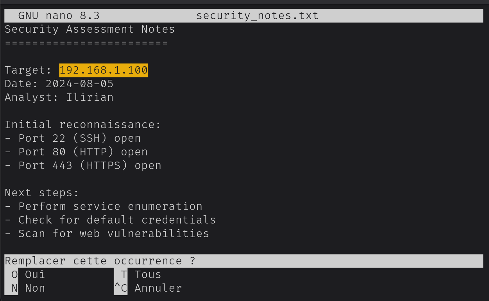
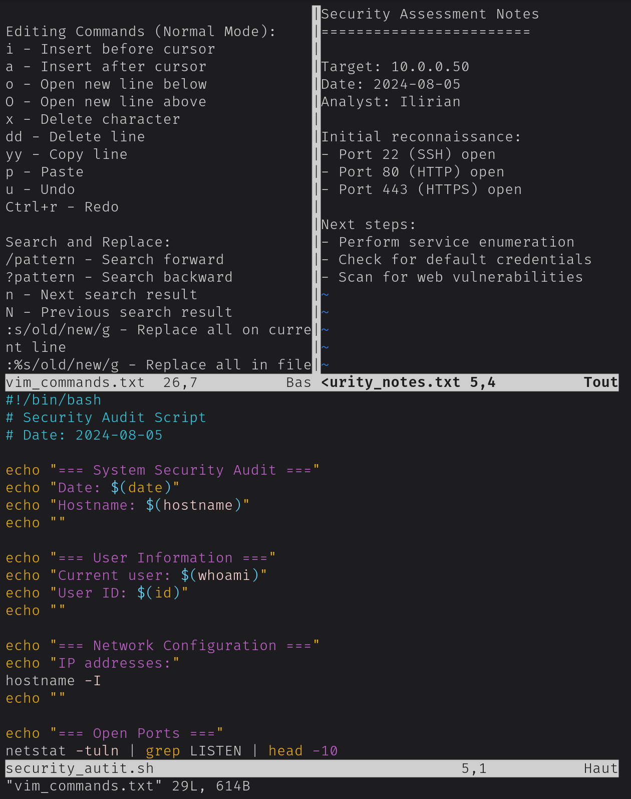

# Line Text Editors Lab: Nano and Vim

## Overview
This lab focuses on discovering **Nano** and **Vim**, two powerful command-line text editors essential for system administration, scripting, and configuration management. The project demonstrates basic and advanced editing techniques, including search/replace, syntax highlighting, and multi-window editing.

---

## Objectives
- Edit configuration files efficiently using **Nano**.
- Create and modify scripts with **Vim**, leveraging its advanced features.
- Practice essential navigation, search/replace, and multi-window editing in Vim.

---

## Methodology

### 1. Nano for Configuration Files
Used **Nano** to edit `security_notes.txt`:
- Located the target IP using **Ctrl+W**.
- Replaced `192.168.1.100` with `10.0.0.50` using **Ctrl+\**.
  

---

### 2. Introduction to Vim
Created `exploit_template.py` in **Vim**:
- Entered **Insert mode** to write a simple Python exploit template.
- Leveraged **syntax highlighting**, a feature not available in Nano.
  

---

### 3. Vim Essential Commands
Created `security_log.txt` with simulated log entries:
- Practiced navigation using **gg** (go to top), **G** (go to bottom), and **/Search** (search within file).
- Replaced all occurrences of `203.0.113.50` with `BLOCKED_IP` using **regex**:
  ```vim
  :%s/203.0.113.50/BLOCKED_IP/g
  ```
  

---

### 4. Advanced Vim Features
Tested **multi-window editing**:
- Split the window horizontally with `:split security_log.txt`.
- Split the window vertically with `:vsplit vim_reference.txt`.
- Navigated between windows using **Ctrl+w**.
  

---

## Key Findings
- **Nano:** Simple and intuitive for quick edits, but lacks advanced features like syntax highlighting.
- **Vim:** Powerful and highly customizable, with advanced navigation, search/replace, and multi-window editing capabilities.
- Vim’s modal editing and commands significantly improve efficiency for repetitive tasks.

---

## Skills Demonstrated
- **Text Editing:** Proficient in both Nano and Vim for configuration and scripting.
- **Navigation:** Efficiently move through files using Vim’s keyboard shortcuts.
- **Search/Replace:** Perform global search and replace operations in Vim.
- **Multi-Window Editing:** Manage multiple files simultaneously in Vim.
